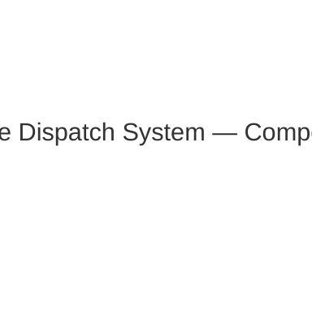
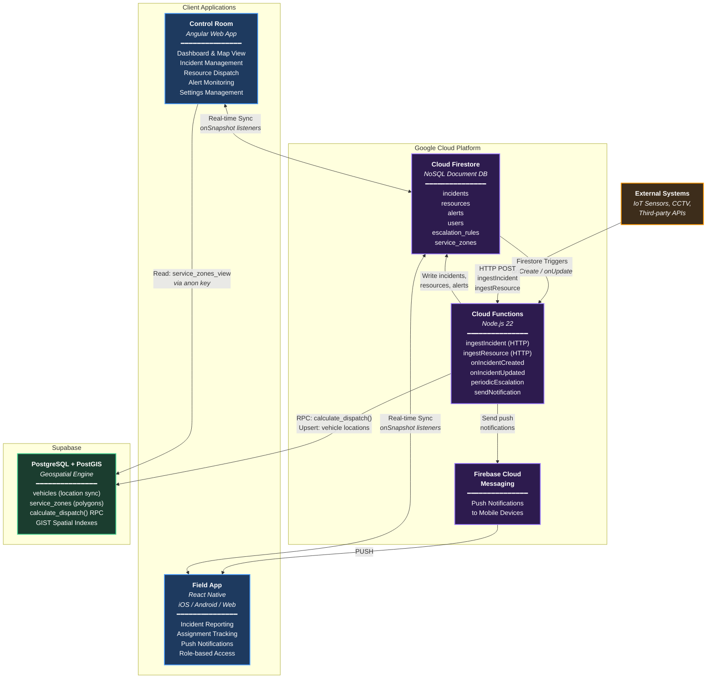

# System Architecture — UML Component Diagram





## Data Flow Summary

```
┌─────────────────────────────────────────────────────────────────────────┐
│                          DATA FLOW OVERVIEW                            │
├─────────────────────────────────────────────────────────────────────────┤
│                                                                         │
│  INGESTION                                                              │
│  ─────────                                                              │
│  Field App / External ──HTTP POST──► Cloud Functions ──► Firestore      │
│                                           │                             │
│  REAL-TIME SYNC                           │                             │
│  ──────────────                           │                             │
│  Firestore ◄──onSnapshot──► Control Room  │                             │
│  Firestore ◄──onSnapshot──► Field App     │                             │
│                                           │                             │
│  SMART DISPATCH                           │                             │
│  ──────────────                           ▼                             │
│  Firestore trigger ──► Cloud Function ──RPC──► Supabase PostGIS         │
│                              │                   │                      │
│                              │         calculate_dispatch()             │
│                              │         (distance + zone penalty)        │
│                              │                   │                      │
│                              ◄───ranked vehicles─┘                      │
│                              │                                          │
│                              ▼                                          │
│                         Firestore (assign vehicle to incident)          │
│                              │                                          │
│  NOTIFICATIONS               ▼                                          │
│  ─────────────          Alert doc created                               │
│                              │                                          │
│                              ▼                                          │
│                    Cloud Function (sendNotification)                     │
│                              │                                          │
│                              ▼                                          │
│                    Firebase Cloud Messaging ──PUSH──► Field App          │
│                                                                         │
│  ESCALATION                                                             │
│  ──────────                                                             │
│  Cloud Scheduler (every 2 min) ──► periodicEscalation()                 │
│                                         │                               │
│                                         ▼                               │
│                              Check unacknowledged incidents              │
│                              Escalate: supervisor → manager → director  │
│                                                                         │
└─────────────────────────────────────────────────────────────────────────┘
```

## Component Responsibilities

| Component | Technology | Responsibility |
|-----------|-----------|----------------|
| **Control Room** | Angular 20, Leaflet, RxJS | Dispatcher dashboard, map visualization, incident/resource management, service zone CRUD |
| **Field App** | React Native 0.79 | Citizen incident reporting, responder assignments, push notifications, multi-role access |
| **Cloud Firestore** | Firebase NoSQL | Real-time source of truth for incidents, resources, alerts, users, escalation rules |
| **Cloud Functions** | Node.js 22, Firebase Functions v2 | Event-driven backend: ingestion, dispatch, escalation, notifications, Supabase sync |
| **Supabase (PostGIS)** | PostgreSQL 15 + PostGIS | Geospatial dispatch engine: distance calculations, service zone boundaries, spatial indexing |
| **Firebase Cloud Messaging** | FCM | Push notifications to iOS/Android field responders |

## Key Integration Patterns

| Pattern | Implementation |
|---------|---------------|
| **Real-time Sync** | Firestore `onSnapshot` listeners in both client apps |
| **Event-driven Backend** | Firestore triggers (`onDocumentCreated`, `onDocumentUpdated`) invoke Cloud Functions |
| **Geospatial RPC** | Cloud Functions call Supabase `calculate_dispatch()` via REST API |
| **Graceful Degradation** | If Supabase is unavailable, dispatch falls back to naive first-available logic |
| **Non-blocking Sync** | Vehicle location sync to Supabase is fire-and-forget; Firestore writes always succeed |
