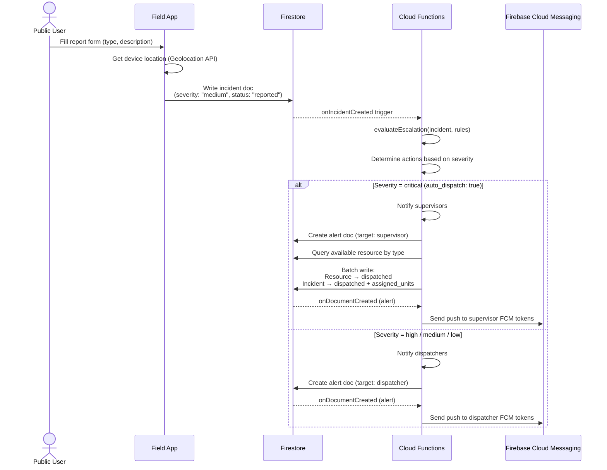
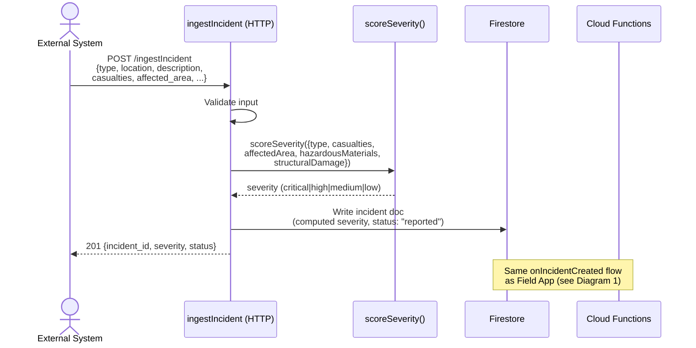
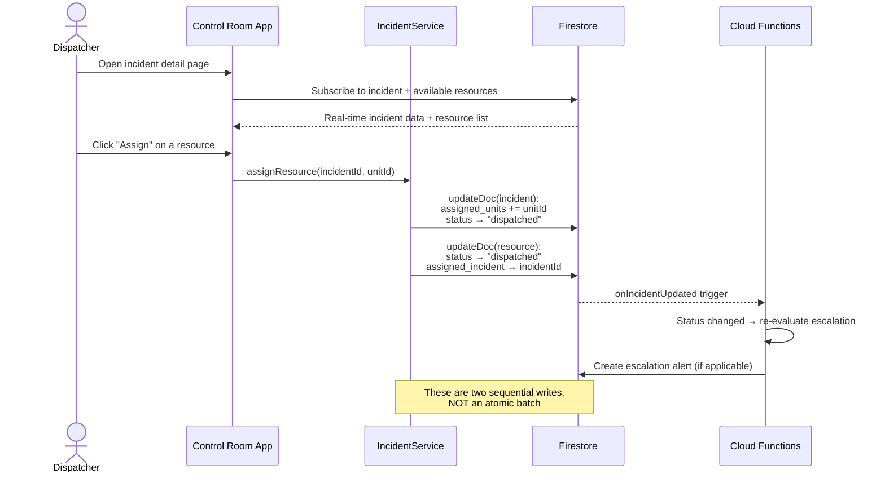
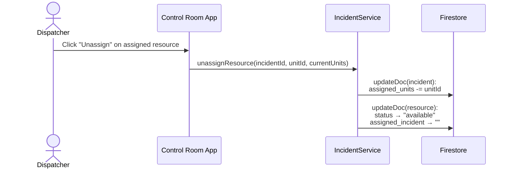
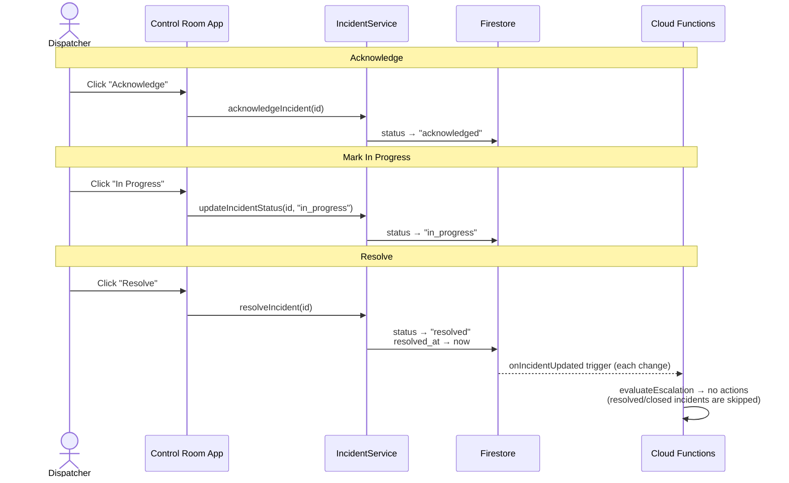
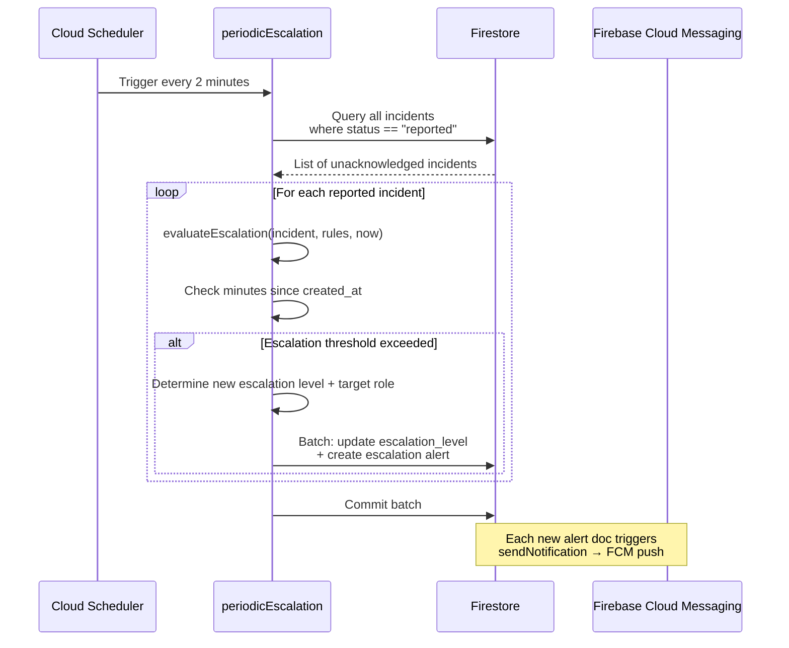
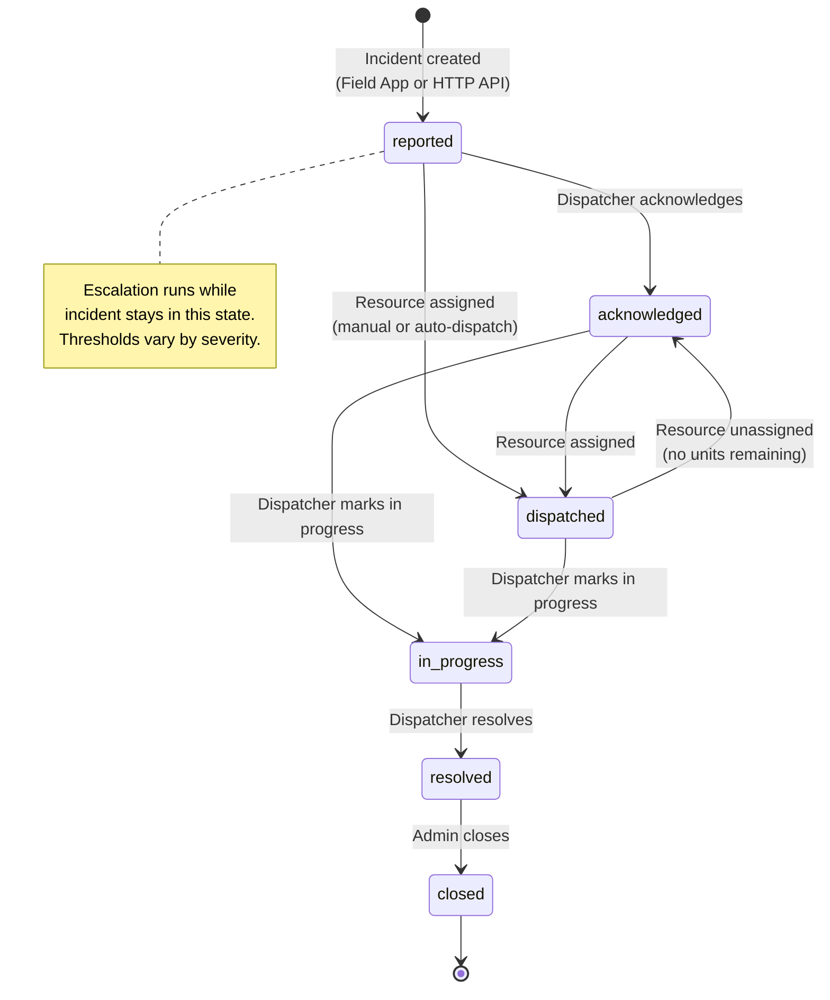
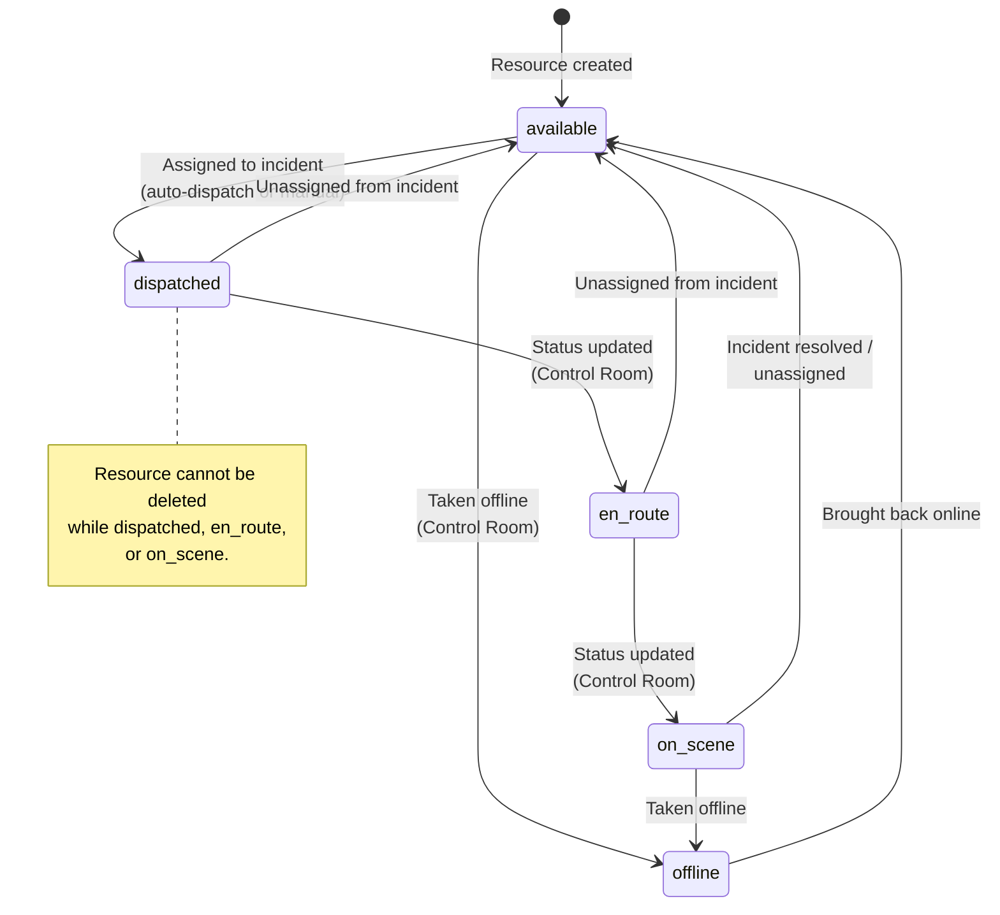

# Incident Lifecycle — Sequence Diagrams

## 1. Incident Creation (Field App — Public User)

## 2. Incident Creation (HTTP Ingestion Endpoint)

## 3. Manual Resource Assignment (Control Room)

## 4. Manual Resource Unassignment (Control Room)

## 5. Incident Status Transitions (Control Room)

## 6. Periodic Escalation (Scheduled Cloud Function)

## 7. Incident Status State Machine

## 8. Resource Status State Machine

